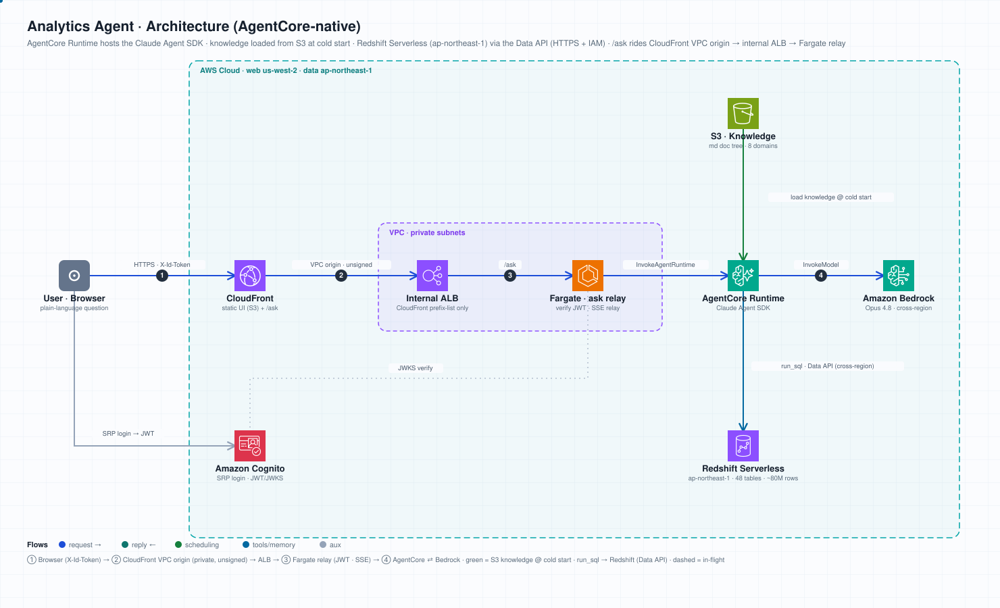

# 演进记录

这个项目不是一次成型的,它从一个 CLI Skill 长成了一个上了云的网页问数应用。这份文档记录它怎么走到现在,方便接手的人理解每个目录为什么存在。

核心假设从头到尾没变:**把数据库 metadata 拆成一棵按需翻阅的 md 文档树,让 Agent 顺路由逐层读出来再写 SQL,比把全库 schema 塞进上下文、或每次从头探索数据库更准更省。** 三个阶段都是这同一个想法在不同形态下的验证。

---

## 阶段一:CLI Agent Skill(起点)

**目标**:在 Claude Code CLI 里做一个数据分析 Skill,用 Progressive Disclosure 按需加载 schema,对比当时流行的多 subagent 方案(每次从头探索、慢、token 贵)。

- 设计了内容+电商混合型 APP 的数据模型:**35 张表 / 8 个业务域**,足够复杂才能体现按需加载的价值。
- 全部 35 张表的 DDL(`database/01-08_*_domain.sql`)+ schema 总览(`database/00_schema_overview.md`)。
- 模块化 Python 数据生成器(`scripts/generators/`),`generate_data.py` 生成约 **19 万行**模拟数据,导出成 35 个 CSV。
- 数据字典本体:一棵 md 文档树(`domains/` 三层 + `metrics/` + `relationships.md`),按路由渐进式披露表结构。
- 早期曾把它放在 `.claude/skills/` 下当 Claude Code CLI skill,还分化出「快捷模板版」和「纯路由版」两套变体做对比;产品化后 CLI skill 那套已弃用,文档树统一收敛为顶层 `knowledge/`(见阶段二/重构说明)。

> 这一阶段最初的数据库跑在 AWS Aurora Serverless v2(ap-northeast-1)+ EKS 里的 pgweb 管理界面上。**该套基建已废弃**,现在本地用 Docker、云上用 EC2 自带的 Postgres 容器。老的 Aurora/EKS 部署方式不再维护。

## 阶段二:产品化为独立 Web App

**目标**:把 Skill 的能力从 CLI 里拿出来,做成一个谁都能打开的网页问数工具,大脑脱离 Claude Code CLI。

- 用 **Claude Agent SDK** 自建 Agent,跑在 **Amazon Bedrock 的 Claude Opus 4.8**(`global.` 跨区推理 profile)上。
- 自建 3 个进程内 MCP 工具(`backend/tools.py`):
  - `read_doc` —— 渐进式披露的核心,按路由逐层读数据字典 md(`domains/_index.md` → 域 index → 表 doc)。
  - `run_sql` —— 只读单条 SELECT,安全边界在 `db.py`。
  - `present_result` —— 交付 KPI / 图表 spec / 洞察 / 追问。
- 早期工具版本用 `get_table_schema` 查 `information_schema` 拿结构;**后来重构成上面的文档路由版**——让 Agent 真正去读那棵 Skill 文档树,而不是查系统表,这样渐进式披露的过程才看得见、可演示。
- 前端 `web/index.html`:把每一步"正在读哪份文档"实时铺开,配合工作流时间线、逐步计时、SQL/结果/图表展示,做成多层渐进式披露的 Demo。后端不可达时自动回退离线模拟数据。
- 数据字典文档树在顶层 `knowledge/`(单一真源),`read_doc` 读它、镜像 `COPY knowledge/` 打进去。

## 阶段三:上云部署

**目标**:部署成一个可长期访问的在线 Demo。

- **EC2 + CloudFront**,两容器:`analytics-app`(FastAPI+Agent SDK)+ `analytics-db`(postgres:16,首启灌 35 表 19 万行)。
- 认证:**app 层 Cognito**(前端 SRP 登录拿 idToken,后端 JWKS 校验),CloudFront / 边缘不碰认证,静态资源可正常缓存,登录后刷新很快。
- 完整部署步骤、认证配置、拆除步骤见 [docs/deployment.md](docs/deployment.md)。

## 阶段四:叠加治理层,覆盖 text-to-insight

**目标**:前三阶段都跑在 35 张**原始表**上,AI 干的本质是 **text-to-ETL**(现场 join、定口径、写复杂 SQL)。但真实生产里业务方面对的往往是**治理后的数据集**。这一阶段在同一套底层数据上叠一层"治理后"的集市表,让一个 demo 同时讲两种范式。

- 新增 `database/09_mart.sql`:4 张 `mart_` 预聚合表(`mart_daily_kpi` / `mart_daily_revenue` / `mart_channel_daily` / `mart_user_summary`),用 CTAS 从原始表跑出来。这段 ETL SQL 本身就是"text-to-ETL 的成品答案",GMV / 新客 / 归因 / 复购等口径在这层被**冻结**。
- 新增知识库文档:`knowledge/domains/mart/` 表卡片 + `knowledge/metrics/governed_metrics.md`(官方指标字典,与 `backend/metrics_def.py` 的 `call_metric` 口径一一对应)。
- `backend/agent.py` 系统提示教 Agent **分层**:取数/看明细走原始域(text-to-ETL);诊断/复盘/综合判断走治理层(text-to-insight),对干净表写简单 SELECT、多角度切片、下判断。
- 前端预设拆成两组:**原始数据·问数** vs **治理层·洞察**,两种范式一眼可见。
- `scripts/docker-init.sh` 在原始表灌完后追加一步构建 mart。现阶段不做 IaC,治理层就是 SQL,随数据库一起重建。

---

## 当前状态

四个阶段都已跑通并验证:本地 CLI Skill 能用、本地 Web App 能跑(含治理层)、可部署到云上(EC2 + CloudFront)。可用于:

1. 演示 Agent Skill 渐进式披露 / 文档路由对 text-to-SQL 准确性的提升。
2. 演示同一套数据上的两种范式:原始表上的 **text-to-ETL**(取数)与治理层上的 **text-to-insight**(诊断/归因/判断)。
3. 作为数据分析类 Agent 的参考实现。
4. 部署一份分享给团队体验。

> 注:治理层(阶段四)已在本地与云上部署验证——Agent 能正确分层、自动归因并主动披露"未归因占比 / 残月口径";`/health` 与前端交互均确认生效。

## 数据规模

| 域 | 表数 | 约行数 |
|----|------|--------|
| 用户域 | 5 | ~4,500 |
| 商品域 | 3 | ~900 |
| 行为域 | 4 | ~55,000 |
| 社交域 | 6 | ~87,000 |
| 归因域 | 5 | ~1,500 |
| 营销域 | 5 | ~33,000 |
| 实验域 | 3 | ~1,900 |
| 交易域 | 4 | ~8,000 |
| **合计** | **35** | **~190,000** |

治理层(mart)不额外造数,是从上面这些原始表 CTAS 派生出来的 4 张预聚合表(每日/渠道/用户粒度),随库一起构建。

---

## 阶段五:AgentCore-native 重构(已上线)

> 状态:**已部署并端到端实测跑通**(us-west-2,浏览器同款请求验证:登录 → 提问 → SSE 流式返回真实 Aurora 数据)。EC2 两容器形态被整体替换。

把「EC2 + Docker Postgres」重构成 serverless 形态:

- **AgentCore Runtime** 托管 Claude Agent SDK(`analyticsagent/`,BYO Container:python + Node20 + claude CLI 非 root 运行)。冷启动做三件事:读 `analytics-agent/runtime` secret 注入配置 → 从 S3 同步知识树(75 个 md)到本地 → 惰性起暖 `ClaudeSDKClient` 跨调用复用,摊薄 CLI 进程拉起成本。**前两件事任一失败就 `raise`**,让这个 microVM 起不来而不是带着空配置进流量池——首次部署时正是这里静默降级过,经过见 [analyticsagent/README.md](analyticsagent/README.md)。
- **知识库放 S3**(`knowledge/` 前缀),更新知识不必重建镜像;`db.py` 连接参数惰性读取,消除「import 早于配置注入」的冷启动竞态。
- **Aurora Serverless v2(PG16)**,Runtime 走 **VPC 私有连接**(psycopg 5432),只读单语句安全边界原样保留;35 表 19 万行由一次性 VPC seeder Lambda 灌入。
- 前端 S3 + CloudFront(OAC);认证仍是 app 层 Cognito(SRP 登录拿 idToken)。
- **`/ask` 中继:Fargate + 内网 ALB + CloudFront VPC origin**(`functions/ask-relay/` + `infra/relay.yaml`)。原计划的 Lambda Function URL 方案(代码已移除)被账号的组织 SCP 堵死——公开 URL 和 Cognito 联合角色的 IAM 调用都被拒,而 CloudFront OAC 又签不了带 body 的 POST。改用同账号 graph-cmdb 已验证的模式:CloudFront 经 VPC origin 私网回源到内网 ALB(SG 只放行 CloudFront origin-facing 前缀列表,零公网暴露、零签名),JWT 走 `X-Id-Token` 直达中继校验后 `InvokeAgentRuntime` 透传 SSE(15s 心跳防读超时)。



基建三个栈:`infra/foundation.yaml`(VPC/端点/NAT/Aurora/桶)、`infra/relay.yaml`(ECS+ALB)、`infra/edge.yaml`(CloudFront);Runtime 由 `@aws/agentcore` CDK CLI 部署(`analyticsagent/agentcore/`)。

> ⚠️ 括号里那句「VPC/端点/NAT/Aurora/桶」是**当时**的 `foundation.yaml`。它 2026-08-23
> 重写过:Aurora、端点、NAT 都删了(数据层换成 Athena 之后 Runtime 不进 VPC)。
> 现行内容见「浏览器入口补齐(2026-08-23)」和那个文件的顶部注释。

有意思的是,阶段一最初就跑在 Aurora Serverless v2 + EKS 上,后来为省事退回 EC2;这次是带着 AgentCore 重新走回 serverless。

---

## 阶段六:数据层换代 —— Redshift Serverless + Glue Data Catalog(已被阶段七取代)

> 状态:**已迁移并全链路验收**(对账、一致性、21/21 评测、端点与渲染契约,`bash scripts/test_all.sh`)。Aurora 退役。
>
> ⚠️ **本节是历史记录,不是现行架构**:Redshift 已在阶段七整体退役,下面写的 8000 万行、
> Data API、`analytics_agent_ro` + 动态脱敏那套治理**现在都不生效了**。内容原样保留(改了
> 就是伪造历史),现行形态见下面的阶段七。

阶段五之后 v1 的两个自认短板:35 表 19 万行说服力不足(全 schema 塞 context 也就几千 token),元数据是手写 md、没人验证。这一阶段把两头都换掉,完整设计与踩坑见 [docs/architecture-v2-redshift-glue.md](docs/architecture-v2-redshift-glue.md):

- **数据搬到 Redshift Serverless**(约 8000 万行,`scripts/gen/` 按 v1 数据 427 倍等比放大,业务比例与口径陷阱原样保留)。查询走 **Data API**(HTTPS + IAM):Runtime 不再需要 VPC 连接、连接池和落地密码,workgroup 保持 `publiclyAccessible=false`。
- **元数据拆成三方并对账**:声明态(`schema_manifest.yaml` + DDL,进 git)/ 实际态(Glue Data Catalog,生成的)/ 语义层(`knowledge/` 卡片),`scripts/glue/reconcile.py` 三方两两比,首跑抓出 5 处真实文档漂移。
- **治理下沉到数仓**(`database/redshift/04_governance.sql`):最小权限角色 `analytics_agent_ro`(48 张表授 45 张,私信表不授权)+ `users.email`/`users.phone`/`user_profiles.birth_date` 动态脱敏,均实测生效。
- **UI 读目录**:新增 `GET /api/catalog`(`backend/catalog.py`),前端元数据不再写死在 HTML;线上用部署期快照 `web/catalog.json`(`scripts/deploy/`),带降级闸门。
- **评测与基线**:`eval/` 21 条金标在 Redshift 上全过;金标保持 Postgres 方言、运行时改写(`scripts/gen/pg_to_redshift.py`);一致性基线由生成器直接吐预期值,对账「生成 → COPY」全链路无损。

v1 的本地 Postgres 路径(`docker-compose.cloud.yml`、`db.py`/`run.sh` 的 postgres 分支、顶层 `database/*.sql`)**保留但不再维护**,边界见 [docs/legacy.md](docs/legacy.md)。

---

## 阶段七:湖仓化 —— S3 Tables(Iceberg)+ Athena(现行)

> 状态:**本地全链路跑通并验收**(2026-08-24:`bash scripts/test_all.sh --l8`
> **39 PASS / 0 FAIL**,L0–L6 全绿 + L8 的 **38 个负测 38/38**(`/ask` 流式契约上一轮单独跑过);
> L7 **27/27**(2026-08-24 重跑,工具闸门改成 `PreToolUse` hook 之后),
> 模型 `global.anthropic.claude-opus-4-8`,均耗时 51.9s/题 · 读文档 2.4 次 · SQL 0.8 条,
> 报告 `eval/report.md`、基线归档在
> `eval/baseline/eval.lakehouse-athena.post-funnel-retention-fix.md`/`.json`)。
> 这一轮是**漏斗与留存口径修完后的第一次全量**:`L4-funnel` 的判定理由从
> 「命中 golden[all-time distinct users]」变成「命中 golden[all-time **subset funnel**]」——
> 上一轮那份 26/26 通过率一样,但判的是**错口径**的金标。新增的 `L5-retention-cohort`
> 是唯一一道会因为"结论写错"而判错的题(判分模式 `retention`,先验结论再比数值),
> 实际判定理由是「结论已声明数据限制;命中 golden[weekly matrix pct] 16/16 个数值」。
> 上一份 26/26 基线(`post-anchor-fix.*`)保留为历史,**两轮之间的差别不在通过率**。
> Redshift 整体退役。
> 验收分层与覆盖面缺口写在 [docs/test-plan.md](docs/test-plan.md)。
> **数据层治理(L4)已实现并在云上验过**(2026-08-20,见下面那一节):专属 IAM 角色 +
> Lake Formation 列级授权,`AGENT_ROLE_ARN` 接进后端,三条断言(离线 / agent 角色实测 /
> 后端接线)全绿。**云上副本 `analyticsagent/` 已与 `backend/` 同源**
> (共享代码改成生成物 + `--check`,见下面那一节),已于 **2026-08-20 首次部署到
> AgentCore Runtime**,并在 **2026-08-23 漏斗/留存口径修完后重新部署(runtime v3)且五条复验全绿**:
> 退款全量 963,560.92、渠道 GMV 与本地 `compiled_sql` 逐字一致、漏斗 `394→314→258→199`、
> 留存 4 个完整窗 cohort 16 个数值全中且结论声明了数据不可用、CloudTrail 证实生效身份是
> 治理角色 `analytics-agent-ro`。首次部署踩到的坑
> (exec role 晚于容器存在 → 那批容器带着空配置永久降级、`success: true` 却一个数都没有)
> 记在 [analyticsagent/README.md](analyticsagent/README.md);已在 `runtime_config.py` 改成硬失败。

阶段六把数据放进了 Redshift,但为此背上了一整层仓库形态的东西:workgroup、datashare、
RPU 容量与用量上限、跨区(数据在 ap-northeast-1、Web 在 us-west-2)。这一阶段把数据层
换成**表桶本身就是目录**的形态:

- **S3 Tables(Apache Iceberg)+ Amazon Athena**,全部收到 us-west-2。表桶联邦进 Glue 之后
  namespace 直接映射成一个 Glue database,整层 datashare 消失;查询是 Athena API 调用
  (HTTPS + IAM),按扫描字节计费——没有"空转"的容量成本,也没有需要保持温热的东西。
- **工具链 `scripts/lakehouse/`**:`setup.py`(建表桶 / namespace / workgroup / 联邦进 Glue)
  → `gen_ddl.py`(从 `database/0[1-8]_*.sql` **生成** `database/iceberg/01_tables.sql`,
  `--check` 断言仓库里那份与现生成的逐字相同)→ `load.py`(灌 `data/csv/`)→ `reconcile.py`
  (声明态 ⟷ Glue 实际态 ⟷ 知识库三方对账)→ `verify_load.py` / `verify_enums.py` /
  `verify_mart_parity.py` / `verify_doc_sql.py`。
  规模:Glue 目录 48 张表、约 22 万行(其中 35 张原始表约 19 万行)。
- **方言换成 Trino**,这是搬迁的主要代价:`::` 强转、`date + 7`、`DISTINCT ON`、
  `interval '30 days'` 全都不合法。金标 SQL 仍是口径单一真源(Postgres 方言),运行时由
  `scripts/gen/pg_to_trino.py` 改写;系统提示、指标 SQL、知识库示例则直接改成
  `interval '30' day` + `CAST`。
- **指标即函数调用**:`backend/metrics_def.py` + `metric_layer.py` 把治理口径编译成 SQL,
  经 `call_metric` 工具调用,`metrics/governed_metrics.md` 由注册表生成。GMV / CAC / ROI /
  退款只有一个权威数,不再每道题现推一遍。
- **统一业务日历锚点**:所有"今天"锚到 `(SELECT max(as_of_date) FROM meta_snapshot)`
  = 2026-01-24,不再用每张表自己的 `max(dt)`——因为各表时间轴末端并不齐
  (`fin_daily_revenue` 到 2026-02-02,`channel_daily_costs` 到 2026-09-01)。这个 bug 实测
  过一次:「哪个渠道 CAC 最低」因此答成了一个在业务日历内根本没花钱的渠道。是否 clamp
  按指标区分(cac/roi clamp,`refund_amount` 不 clamp)。

这一阶段修掉的都是**同一类缺陷:不报错、数看着合理、结论是反的**。除上面的锚点问题,还有两个:

- **判分器不认数量级单位**:KPI 卡片按中文习惯写 `{"value": 144.99, "unit": "万"}`,金标 SQL
  出的是 1449872.13,于是「各渠道投放一共花了多少钱」被判 fail——而 agent 的 SQL、数据源、
  明细、总数全对。`eval/run_eval.py` 的 `agent_numbers()` 改成按 **agent 自己声明的 unit**
  同时收原值和换算值。这类漏判比漏抓错数更坏:它会逼着以后写用例的人去放宽容差。
- **`AWS_REGION` 依赖 import 顺序**:`backend/agent.py` 在 import 时把 `AWS_REGION` 写进进程
  环境,而数据层(`scripts/lakehouse/athena.py`、`backend/catalog.py`)读的是同一个变量。
  它原来兜底成 `us-east-1`,于是谁先 import 谁说话:先 import agent 的入口会让 Athena 客户端
  跑去 us-east-1,报 `WorkGroup is not found`——错误指向工作组,成因却是 region。已对齐成
  `us-west-2`。
- **一致性基线改成实时对账**:`scripts/lakehouse/verify_load.py` 不再读那份生成器时代的
  `consistency.generator-expected.json`(它记的是 21 万行时代的绝对值,与现在的 `data/csv/`
  已经不是同一批数据),改成 CSV ⟷ Athena 实时逐表比对。原话写在脚本头上:
  **基线会过期,而且过期时是绿的**。

### 枚举取值漂移:对账的第三条路径

前两条对账路径(`gen_ddl.py --check` 比声明态、`reconcile.py` 比表和列)都管不到**列里装的值**。
卡片写 `status='active'` 而数据里是 `'on_sale'` 时:SQL 语法正确、目录对账全绿、EXPLAIN 通过、
跑出来是**空集**——然后"没有在售商品"这个结论就被端出去了。这是本项目那类缺陷最纯的形态。

于是加了 `scripts/lakehouse/verify_enums.py`(挂进 `test_all.sh` 的 L0 自测 + L2):把
`knowledge/domains/**` 卡片里 `### <列名>` 小节的 markdown 枚举表跟 Athena 实际取值双向比,
**两个方向都算失败**(卡片多写了不存在的值,或数据里有卡片没写的值)。非列的小节按
`information_schema.columns` 剔除,布尔列和取值超 50 个的列跳过。

第一次跑就抓出 **46 处漂移**。样本:

| 卡片列 | 卡片原来写的 | 实际取值 |
|---|---|---|
| `events.event_name` | `product_view` / `checkout` / `registration` / `app_install` / `first_open` / `button_click` | `view_product` / `begin_checkout` / `register`……(这六个**一个都不存在**) |
| `user_coupons.source` | `campaign` / `manual` / `referral` / `purchase` | `claim` 13,649 / `gift` 3,466 / `reward` 3,327 / `system` 2,293(四个全错) |
| `coupons.coupon_type` | `fixed` / `shipping` | `fixed_amount` 78 / `percentage` 54 / `free_shipping` 18 |
| `push_notifications.push_type` | `marketing` / `transactional` | `reminder` / `social` / `promotion` / `order` / `system` |
| `banners.position` | 漏了三个 | 漏掉的 `cart_bottom`+`splash`+`search_top` 占 **57% 的行** |
| `user_attributions.attribution_type` | 含 `linear` | 只有 `first_touch` 175 / `last_touch` 175 |

`events.event_name` 那条最要命:漏斗题的四个事件名有两个是错的,照卡片写出来的漏斗**每一级都是 0**。

顺带修完后全部 41 列一致、0 跳过。还挖出三类「不报错但结果为空/为 NULL」的东西,都在卡片里加了 ⚠️:

- **没声明的软外键 JOIN 到零行**:`user_coupons.order_id` → `orders` 11,297 行**零匹配**;
  `events` 里 `purchase` 事件的 `properties.order_id`(小整数)→ `orders.order_id`(12 位)
  772 行**零匹配**。问"用券订单的客单价"会拿到空集,读成"没人用券下单"。
- **25 类事件里 21 类的 `properties` 是 `{}`**,`event_definitions.properties_schema` 25/25 全 NULL,
  `search` 事件没有 `result_count`。卡片里那些"按 property 下钻"的示例查询原来会静默返回 NULL。
- **几列全 NULL 的枚举**:`ad_creatives.creative_format`(144/144)、
  `push_notifications.failure_reason`(10,000/10,000)、`user_attributions.tracking_params`。
  失败率这类指标在这份数据上**算不出来**,不能把 0 当成"没有失败"。

### 一个静态快照在替不存在的治理层背书

`web/catalog.json` 是部署期从真 Glue 生成的元数据快照(没有后端时前端的兜底源)。它当时还是
v2 的产物:`engine: "Redshift Serverless"`、`region: ap-northeast-1`、`rows: 79,924,448`——
以及 `governance.available: true` 带着一份掩码列清单。也就是说**每个访客都会看到"PII 已脱敏"
的治理面板,而湖仓上治理层根本没实现,`users.email` / `phone` 在 Athena 里是明文**。

重新生成之后:`engine: "Athena + S3 Tables (Iceberg)"`、`region: us-west-2`、48 张表、
`governance: {available: false, reason: …}`(治理层当时还没建;现在建好了,快照里是
`available: true` + 47/48 授权 + 3 个不授权的 PII 列)。
`web/index.html` 的注释也写清了这条原则:**治理层没实现时面板要显示"为什么没有",
而不是画一个空的"已脱敏"——一个看起来齐全的治理面板比没有面板更危险。**

行数那两个键在治理层建好之后**变了**,这里记下来免得下次被当成数据丢了:现在是
`rows: 180,419` / `rows_all_layers: 210,834`。差的 9,253 行是 `user_messages` ——
`catalog.py` 跑在 `analytics-agent-ro` 下,这张表不在授权面里,`count(*)` 失败即丢键,
于是它悄悄不进总数。数据一行没少(`verify_load.py` 逐表比 CSV 全等),少的是**视角**。
所以 `totals` 里另加了 `rows_uncounted_governed` / `rows_uncounted_failed` 两个键,
前端跟在行数后面显示「另有 1 张表不授权,未计入」:一个少 5% 又没人解释的数字比不显示更糟。
两个键分开是因为成因不同——前者是治理按设计挡的正常现状,后者是真故障,不该混着看。

### L8 负测:验证检查器本身(2026-08-19)

上面这一整套对账/校验脚本有个没被回答的问题:**它们该报的时候真会报吗?** L0–L6 全绿
只说明"现在没问题",不说明检查器还有效。一个永远绿的检查器和没有检查器等价,而且更糟
——它让人以为这块有人看着。

新增 `scripts/negative_tests.py`(**17 个用例,17/17 通过**,`bash scripts/test_all.sh --l8`
挂在套件末尾)。每个用例往对应检查器守的那个**真实缺陷**上打一枪:先跑未注入的命令并
要求 exit 0(否则"变红"可能与注入无关)→ 注入,要求 exit 非 0 **且输出匹配预期消息**
(换个原因红了不算过)→ 还原并用 sha256 核对。注入用唯一子串替换,锚点必须恰好出现一次,
所以锚点漂移是显式 ERROR 而不是静默改了别的地方。**不用 `git checkout` 还原**(工作树里
有大量未提交改动)。`reconcile.py` 的 A–I 八类 finding 现在全部有对应负测(E 类是 Redshift
的 DDM 检查,随 Redshift 退役)。

写这套负测的过程本身抓出**两个真缺陷**,都是"检查器没人验证"的产物:

- **名字比覆盖面大**:`scripts/manifest/render.py --check` 只校验 manifest 合法,
  **从不比对生成物**,而 `test_all.sh` 那一行标的是「派生层知识卡片是最新渲染」。
  手改一张生成的卡片,它照样打印 `manifest OK` 并 exit 0。已修:`--check` 现在逐字比对
  全部 15 个产物,漂移时打印逐文件差异行数。
- **零覆盖**:`backend/db.py` 的只读闸是 L4 治理层没实现之前**唯一**生效的安全边界,
  而整套测试里没有一条断言碰过它——把 `_FORBIDDEN` 改松不会让任何东西变红。已修:
  `python3 backend/db.py` 是它的自测(10 类拒绝 + 9 条放行 + 1 项**已知的过度拒绝**
  钉在那里:`WHERE action = 'delete'` 会被拦,宁可误拒也不误放,但这行为要看得见)。

这两条与之前踩过的两次**假阳性**(卡片枚举行被当列名、`IS NOT NULL` 里的 `is` 被当列名)
是不同形态:假阳性会自己暴露,这两种不会。

顺带补上一个文档缺口:此前没有面向当前架构的验收文档,`scripts/test_all.sh` 是事实上的
唯一真源,`docs/test-plan-v2.md` 只是历史。新增 [docs/test-plan.md](docs/test-plan.md)
——L0–L8 每层跑什么/挂了说明什么、17 个负测清单、**「没有自动化覆盖」清单**(治理层、
云上副本、`catalog.json` 新鲜度、卡片散文正文、agent 判断质量、扫描字节成本……)、
以及改动 → 测试步覆盖矩阵。最后一节最重要:不写出来,"全绿"会被读成"全都验过了"。

### L4 治理层:最小权限角色 + 列级排除(2026-08-20)

阶段六在 Redshift 里的那两道查询时控制(最小权限角色 + 动态脱敏)之前没有 v3 等价物,
湖仓一直跑在 data lake admin 全量授权下。这一节把它补上,新增
`scripts/lakehouse/governance.py`:

- **身份**:专属 IAM 角色 `analytics-agent-ro`(内联策略 `lakehouse-read`)。后端设了
  `AGENT_ROLE_ARN` 就 AssumeRole 用它查数,`backend_info()["identity"]` 回传生效身份——
  那是从外面唯一能看见"治理接上了没有"的地方。凭证走 botocore 的
  `DeferredRefreshableCredentials`,**会自动续期**:一次性 `sts.assume_role()` 约 1 小时
  就过期,会炸在 agent 答到一半的某条查询上。
- **授权面**:Lake Formation 列级 SELECT。`user_messages` 整表不授权;
  `users.email` / `phone`、`user_profiles.birth_date` 用 `ColumnWildcard.ExcludedColumnNames`
  排除。**LF 没有值级掩码原语**,所以 v2 那个 `***@masked.invalid` 换成了"这列根本不在
  授权面里":`SELECT *` 里没有它,点名查报 `COLUMN_NOT_FOUND`。前端 `masked` 这个键名为
  契约保留,文案改成了「不授权的列」。
- **为什么不走 Glue Catalog View**:那条路能做真掩码,代价是 48 张表各复制一份视图、
  外加一个没人对账的第二元数据面。选择是明写在 docstring 里的,不是悄悄换的。

四个踩出来的点:

1. **LF 授权是可叠加的**。发一条 `TableWildcard` 就会盖掉列级排除,所以只发列级授权,
   多出来的宽授权由 `--verify` 报成漂移(要撤得显式 `--revoke-extra`)。
2. **改排除清单必须先 revoke**,加发一条不会收窄授权面。
3. **同名但没打 `Project` 标签的角色一律拒绝动它**——那可能是别人的角色。
4. **明文旁路**:中转库 `analytics_agent_raw` 里的 `*_csv` 外部表指着
   `s3://analytics-agent-raw/csv/`,是明文 CSV,**Lake Formation 完全看不见**。
   所以角色的 S3 读被钉死在 `athena-staging/`,离线断言 + 云上探针各盯一遍。
   少了这道,上面所有列级授权都是装饰,而云上探针一条都不会红。

三条断言进了 `test_all.sh` 的 L4(原来那节只打印"缺什么"):

| 检查 | 独有覆盖 |
|---|---|
| `--selftest`(离线) | 策略清单 ⟷ 验收契约互相覆盖;IAM 策略窄不窄(含 `csv/` 旁路,配了正反对照) |
| `--verify`(连云) | 授权面比对 + **以 agent 角色实测 16 条探针** |
| `--verify-backend` | 后端确实在用受限凭证,且它读不到 `users.email` |

那两份清单(`EXCLUDE_COLUMNS` / `DENY_TABLES` 与 `MUST_NOT_READ_*`)**刻意不互相推导**:
验收契约要是从策略现算,"有人把一列从策略里拿掉"这个缺陷注入完自测照样全绿。

L8 因此从 17 个用例涨到 **20 个**,新增的三个正好对上 L8 那三种失败形态:
`gov-policy-loosened`(策略被改松,离线就该红)、`gov-probe-blind`(探针换成 admin 身份跑
必须全红,**全绿即零覆盖**)、`gov-backend-not-assuming`(角色建好了、权限发了,而 `db.py`
仍用 admin 凭证查——`/health` 看起来还是对的,这是最像真实回归的那一种)。

### L7 抓到的一次真回归:没点明范围时的静默收窄(2026-08-20)

修完时间锚点之后重跑 26 题,`L3-refund-total`(「这段时间一共退了多少钱?退款总额是多少?」)
从 ✅ 变 ❌:agent 把**没点明时间范围**的问题默认成了「近 30 天」,答 28.11 万,而全量是
96.36 万——差 3.4 倍。0 条 SQL、0 次读文档(走 `call_metric`),所以连"SQL 写错了"这种
线索都没有;答案里还大方写着「我按截至 2026-01-24 的近 30 天来算」,听起来很专业。
这正是这套评测存在的理由:**不报错、数看着正常、口径悄悄换了一个**。

修在 SYSTEM 提示词里:问句没点明范围一律全量(`time_window="all"`),「一共/累计/总额/
这段时间」都算全量;真出现了时间词才切窗口。但**全量 ≠ 不加日期条件**——比值类要补
`dt <= 锚点` 的上界,否则全量 CAC 会拿铺到 2026-09-01 的成本去除一段根本没有新客的日子。
这两条得一起写:只写前半条会把 `L3-cac-overall` / `L4-cac-lowest-channel` 弄错,
而那两题原本是过的。改完 26/26。

### 云上副本:从手工副本改成生成物(2026-08-20)

`analyticsagent/app/analytics/` 一直是 `backend/` 的**手工副本**,阶段七只改了 `backend/`,
于是两边分叉到:`db.py` 518 ⟷ 165 行、`agent.py` 的 SYSTEM 提示词 8696 ⟷ 6203 字符、
`metrics_def.py` 324 ⟷ 177 行(`stats.py` 恰好逐字相同——**正是这种"碰巧一样"的文件
让分叉的那几个看不出来**)。云上那份还在教「拿该表自己的 `max(dt)` 当今天」:
同一个「近 30 天各渠道 GMV」,本地答 100.8 万,云上答 **0**。整套测试一条都不碰它。

修的方式不是"再手工拷一遍"(那只会把同一个坑重挖一次),而是套用仓库里已有的
**生成物 + `--check`** 范式,新增 `scripts/deploy/sync_agent_code.py`:

- 6 份**整份逐字拷贝**:`db.py` / `tools.py` / `metric_layer.py` / `metrics_def.py` /
  `stats.py` ← `backend/`,`athena.py` ← `scripts/lakehouse/`(**平铺**在那个目录里:
  构建上下文就是 `codeLocation: app/analytics/`,`COPY` 到不了上一级)。
- `agent.py` 只同步 **15 个顶层节点**(提示词 `SYSTEM` / `LITE_SUFFIX` / `DEEP_SUFFIX` /
  `ALLOWED` 与共享解析辅助),按 AST 逐节点比。因为两侧驱动是**刻意不同**的:
  本地是 `run_agent()`(FastAPI 每问一个 `ClaudeSDKClient`),云上是
  `build_options()` + `stream_events()`(`main.py` 持一个暖客户端跨调用复用,
  省掉每次 8-10s 的 CLI 拉起)。**驱动不同,提示词必须相同**——bug 就住在提示词里。

为了让副本能"逐字相同"而不是"拷完再改两行",顺手改掉了两处需要人工差异的地方:
`tools.py` 的 `DOCS_ROOT` 改读 `KNOWLEDGE_DIR`(之前是两份文件各写一行路径),
`db.py::_athena()` 先裸 `import athena` 再回退仓库布局(容器里那份是平铺的)。

反向也捞到一个:云上那份 `agent.py` 有个 `_norm_method()` 防呆,`backend/` 没有——
模型偶尔把 `method.formula` 写成字符串,前端 `(mt.formula||[]).map` 抛异常,
UI 上显示成**「后端连接失败」**。一次模型笔误被渲染成一次基础设施故障,
排查方向从一开始就是错的。已经并回 `backend/`,两侧现在发同一种事件形状。

顺带清掉的:`agentcore.json` 里钉着的真实 subnet / SG / VPC ID(Aurora 时代要进私网连库;
Athena / Glue / S3 Tables 都是 HTTPS + IAM,`networkMode` 改回 `PUBLIC`),
`requirements.txt` 里的 psycopg,以及 `PYTHON_3_14` ⟷ `FROM python:3.11-slim` 的错配。

进测试的是两行 L0(`--selftest` 验检查器认得出漂移、`--check` 验副本没漂),
L8 加了第 21 个用例 `cloud-copy-drift`——注入的就是那次真实分叉:
把云上副本的时间锚点改回各表自己的 `max(dt)`。

**写这一节时仍然没做的**:部署。这条路只做到"代码与本地同源",没在 AgentCore 上跑过一次。
部署前置条件与部署后要复验的口径写在 `analyticsagent/README.md`(**那里的期望值别写死具体数字**
——初版把渠道 GMV 钉成 100.8 万,数据重灌后就不成立了,而它过期的时候 README 看着完全正常)。
后来分两次补上了:2026-08-20 首次部署,2026-08-23 口径修完后重新部署 ——
见下面「云上重新部署与口径复验(2026-08-23)」。**但那两次部的都只是最里面一段(Runtime)**,
外面那两段(CloudFront + Cognito 接入层、`/ask` 的 Fargate 中继)是 2026-08-23 同日
另外补的,见下面「浏览器入口补齐(2026-08-23)」。

### 前端存活探针:一个照本地 Postgres 定的超时,把整页变成离线演示(2026-08-20)

用户起完后端、打开 `http://127.0.0.1:8000/`,页面右上角标**「离线演示模式」**,底部提示
**「后端未连接,请启动后端」**——而后端就在那儿好好跑着,`curl /health` 回 `ok: true`。
问「这段时间一共退了多少钱」,答的是**DAU 走势**。

成因在 `web/index.html` 的启动探针:一发 `/health`、超时 `2500ms`、超时即**永久**降级到
写死的烘焙数据。那个 2500 是本地 Postgres 时代照 `SELECT 1` 的几十毫秒定的。换成 Athena
之后,新进程第一发 `/health` **实测 5.0s**(建 boto3 客户端 + AssumeRole 拿凭证 + 一次真
Athena 查询排队执行),之后才落到 1.2–1.9s。也就是说**「起完后端第一次打开页面」不是概率
性失败,是必然失败**;刷新一次反而好了(第二发是热的),于是它看起来像"偶发",归因指向
后端,而后端没问题。

坏的形态还是那一类:不报错、给答案、答的是另一个问题。烘焙答案走的是关键词粗路由,
"退款"落到默认那条(DAU),所以数字看着完全正常。

**第一次修法是错的,而且是新加的那条断言当场抓住的**:我把预算改成 `12000ms`,而 L6 那条
「预算 ≥ 2× 冷启动实测」立刻量到 **12.5s**(同一台机器另一次是 5.0s)。任何写死的毫秒数都是
在猜一个云上的分位数,猜大一点只是把下一次翻车往后推。这件事本身值得记:**那条断言的价值
不在于它证明了我的修法对,而在于它证明了不对。**

正解是换判据——让后端告诉前端它**在不在**,别让 Athena 的延迟去裁决这件事:

- **`/health` 三态**(`backend/server.py`):`ok=true, dataLayer="ok"` / `ok=false,
  dataLayer="warming"`(后端在,第一发 ping 还没回来)/ `ok=false, dataLayer="error"`
  (探完了,不通)。"连不上"是第四种,前端自己看得见。ping 改成后台线程 + 事件等待,
  `/health` 最多等 2s 就照实回 `warming`,**不再等 Athena 查完才回**。
- **前端**(`web/index.html`):`warming` ⟹ 继续等(最多 30 发 × 1.5s ≈ 45s);
  `error` / 连不上 ⟹ 攒够 3 发才降级。单发超时因此只需覆盖"后端答一句话",8s 极宽裕。
  等待期间界面停在初始的「连接中…」而不是先渲染成「离线演示模式」再翻回来——那个标签会
  被读成结论。一直 `warming` 也要**有限**放弃:永远转圈同样是不说实话。
  `ask()` 改成 `await BOOT`:探针还没跑完就提问要**等它**,不能就地按当前 `MODE` 分派。
- **启动预热**(lifespan):后台起一发 ping,让用户"起完后端就打开页面"时那一发大概率已经
  在飞。这只是省时间,**不是正确性的依赖**——正确性由三态保证。预热失败一律不抛:就绪门是
  `/health`,在启动路径上抛只会把数据层问题伪装成"服务起不来"。
- **ping 结果短缓存**(10s):`db.ping()` 是一次真 Athena 查询(按扫描字节计费),而探针会重试、
  用户会刷新。放在 `server.py` 而不是 `db.py`——后者逐字同步到云上副本,且 ping 作为**探针
  原语**应当每次真探。想强制真探:`/health?fresh=1`。

顺着这条线还量出两个**本来就在、只是没人看**的浪费:`/health` 冷启动 4.06s 里有 1.93s 是
`db.backend_info()`——它要 AssumeRole 才填得出 `identity` 字段,而它当时**直接在 async 函数
里同步调**,既阻塞事件循环又和 ping 的等待串行相加(现在两件事 `asyncio.gather` 并发跑)。
更深一层:`db.py::_athena()` 的惰性初始化**没有锁**,`if _ath_client is None` 谁进来都重做一遍
AssumeRole + 建客户端,两个并发调用者各做一遍还互抢 GIL(实测 5.0s / 3.2s)。加了双检锁之后
冷启动 `/health` 从 4.06s 降到 **2.007s**(就是那个 2s 上限),热了 2.9ms。

外加一条兜底:真降级时,烘焙答案的正文**开头带上声明**(「离线演示模式的预置示例答案…
也可能跟你问的根本不是一回事」)。上面三处都失效时,至少那个数字不会被当成查出来的。

**为什么此前零覆盖,这是重点**:`render_test.mjs` 把 `fetch` 打成必抛,并且调的是一个
**假的** `boot()`(直接 `MODE='live'`),真 `boot()` 一行没跑过;L6 那几条 curl **不带超时**,
而且跑之前已经轮询把后端等热了。**没有跨过真实阈值的测试,对那个阈值零覆盖。**
补的两条:

- L0 `scripts/ui/boot_test.mjs` —— 假 fetch 跑**真** `boot()`,十个场景:慢探针
  (3000ms,恰好跨过旧的 2500 预算)仍应上线 / 探不通才降级且徽标要说离线 /
  `dataLayer=error` 也算不活 / 前两发失败第三发通仍应上线 / 探针期间提问要真打 `/ask` /
  **连续 5 发 warming 之后探通仍应上线** / **一直 warming 也要有限放弃** /
  **页面先开、后端后起要自愈回实时**(前 10 发不可达、第 11 发通) / **降级过的页面提问时
  后端已经活了就必须走真实链路** / **`file://` 打开时底部不许提示"启动后端"**。时间整体按
  同一系数缩放,所以它跑在四秒内,且**不写死任何毫秒阈值**(比值不变)。
- L6 三条 —— `/health` 首次响应 ≤ 单发预算的一半(盯的是"后端答得快",不是"Athena 快");
  数据层预热耗时 ≤ 前端等 `warming` 的窗口的一半;`/health` 真的带 `dataLayer`。三个常量
  都从 `web/index.html` **grep 出来**,不在测试里抄第二份(抄了两边会各自漂)。

L8 加了两个用例,对应同一个缺陷的两种走法:`probe-budget-too-tight` 把预算改回 2500;
`probe-warming-treated-as-dead` 把 `warming` 算进「失败」的额度——后端明说"我在,只是还在
预热",前端却当它不在。两个都要 node,没装则打印 `⊘ … 跳过`——`Case` 因此多了个 `requires`
字段,缺依赖既不假红也不静默少跑。(第三、四个 `probe-*` 用例见下一节。)

### 同一处代码的第三幕:降级是**单向**的,于是"重启也刷新了还是一模一样"(2026-08-21)

上面三态 + 重试都上线、35 项全绿之后,用户报的现象**一个字没变**:打开前端仍是离线演示模式。
排查过的、结论是"不是它"的:后端进程确实是新代码(PID 起于修完之后)、`/health` 确实回
`{"ok":true,"dataLayer":"ok"}`、浏览器拿到的 `/app/index.html` 确实带新探针常量、
`Cache-Control: no-store` 在位、没有 service worker。

真因在 `boot()` 的收尾:`break` 出重试循环之后 `MODE='baked'` 就结束了,**这一页在它整个
生命周期里再也不看一眼后端**。而失败额度只有 `PROBE_FAIL_ATTEMPTS`(3)发 × 1.5s ≈ **3s**,
比 uvicorn 打开端口还短——「重启后端 → 立刻刷新页面」这个最自然的动作,三发全落在
connection refused 上,页面就永久锁死,后端随后热起来也没人再问。**从用户角度看,
"重启 + 刷新"这个万能操作失效了,而归因指向"你改的东西没生效"——它生效了,只是救不了
这条路。**这也是这类缺陷最贵的地方:三次翻车,三次表现完全一样。

修法不是再调数字,是让降级**可逆**(`web/index.html`):

- 降级后**退避重探**(3s → ×1.5 → 上限 15s,总窗口 2 分钟)。有上限是刻意的:探通的
  `/health` 会真查一次 Athena,无限轮询等于给一个没人看的空闲页面持续记费。
- 标签页**重新可见**时探一发——切回来这个动作本身就是"我要用了",而且不花后台轮询的钱。
- **提问前**探一发。这条兜住最贵的失败:后端活着,而用户拿到烘焙答案(问退款给 DAU 走势)。
- 方向只有 baked → live 一个:live 不会退回 baked。半途换掉一个已经给过答案的页面的身份
  标签,比继续用当前模式更容易被误读。

同一轮还修掉 `/health` 一个 2 秒的白等:TTL 过期时原来先 `ev.wait(2s)` 等在飞的那一发、
等不到才退回上一次结果,实测让一个 `ok:true` 的响应也要 **2.011s**。现在手上有旧结果就
立刻回(代价是最多旧一个 TTL + 一发 ping,对"后端在不在"足够),实测 **0.003s**。它让
"刷新赶不上"更容易发生,算这次事故的帮凶。

验证方式两条,都跨过了真实边界:

- `boot_test.mjs` 新增场景⑧⑨,**先看它们红**(5 项断言失败,⑧ 全程只探了 3 发)再修,
  修完 9 个场景全绿;L8 补 `probe-degrade-is-permanent` / `probe-baked-answer-while-backend-alive`
  两个用例(删掉自愈那一行 / 删掉提问前重探那一行),两者都确实变红。
- **真 Chrome**(headless)打一个桩服务:前 3 发 `/health` 断连、之后回 live。渲染结果从
  离线翻成 `claude-opus-4-8 · Amazon Bedrock` + 底部"querying the live warehouse",
  桩日志显示第 4 发才是 live——即用户那条路径在真浏览器里自愈了。同一轮也拿真 Chrome
  打了用户那个跑着的 8000 实例,渲染出 48 张表 + `Athena + S3 Tables (Iceberg)`。

### 同一份 shell,两套挂载布局:本地图表一直是空白的(2026-08-21)

上面那轮修完、页面终于稳定显示实时链路之后,uvicorn 日志里还剩三条 404:

```
GET /vendor/fonts/fonts.css   404
GET /config.js                404
GET /vendor/echarts.min.js    404
```

文件都在(`web/vendor/echarts.min.js` 1.0MB),是**布局**问题:同一份 `web/index.html`
要在两个地方跑——线上在 S3 站点根(`/vendor/x` 正好对),本地被 FastAPI 挂在 `/app` 下
(`server.py` 只 `mount("/app", ...)`)。于是绝对路径 `/vendor/...` 在本地落到根上,没人接。

现象又是这个项目最典型的那一类:**不报错、看着正常、其实少了东西**。`echarts` 未定义,
`renderChart` 抛 ReferenceError,但那句在 `setTimeout(...,400)` 里执行,所以解读、KPI 卡、
洞察、SQL、数据表**全都照常渲染**,只有图表框是空白的;字体同时退回系统默认
(Fraunces/Hanken Grotesk 全丢)。界面上没有一句红字,唯一的线索是访问日志。它在本地
瘸了一段时间没人知道——因为**整套验收里没有一条断言碰过"页面引用的资源取不取得到"**。

修法:本地资源一律相对路径(`vendor/...`),两套布局下都对,也不依赖挂载前缀。唯一的例外是
`/config.js`——它的语义是"站点根上那份部署期生成的产物",不该跟着 shell 的挂载点走,所以
保持绝对路径,由 `server.py` 回一个空脚本兜住(`window.APP_CONFIG` 依然缺席 → 回退
`/api/config`,行为一字不变,只是日志里不再有一条会误导排查的 404)。

新增检查器 `scripts/ui/asset_check.py`,双模:静态那份进 L0(核对"路径是相对的 + 文件在
`web/` 下 + 那个例外确实有路由接"),**真取一遍**那份进 L6(逐个 HTTP 200,因此还覆盖挂载点
本身和那条兜底路由——静态检查看不见路由)。两条失败分支都单独验过会红(改回绝对路径 /
摘掉 `/config.js` 路由),并落成 L8 的 `shell-asset-absolute-path`
和 `shell-config-js-route-gone`。

顺带堵掉一条**同貌不同因**的路:用 `file://` 双击打开时探针必然连不上(跨源请求带
`Origin: null`,不在后端 CORS 白名单里),而此前底部照旧提示"启动后端"——后端很可能正
跑着,这句提示把人指向错误方向,而现象与"后端没起"一字不差。现在这种情形底部明说
"请改用 http://127.0.0.1:8000/ 打开"(场景⑩钉住:不许出现 `run.sh`)。

### 判分器自己判错了方向:漏斗口径,一个错误住在七个地方(2026-08-21)

浏览器上人工抽两道题验收,第二题是「转化漏斗各步转化率」。答案读起来很专业,还主动加了
免责声明:

> 说实话,这份数据几乎不衰减——各步去重用户数很接近,甚至「发起结算」比「浏览商品」还多,
> 不是真实业务漏斗形态。全量去重用户口径下四步为:浏览商品 394 → 加购 385 →
> 发起结算 396 → 支付成功 373。⚠️ 但这份是随机种子数据……建议改用交易表交叉验证。

四个数排在一起就已经说明问题了:**396 > 394**。漏斗每一步都是上一步的子集,人数必然
单调不增,不可能中间反弹。agent 的 SQL 是四个互不相干的
`COUNT(DISTINCT CASE WHEN event_name=… THEN user_id END)`,没有时间窗、也没有
「本步用户必须也做过上一步」这个约束——**它算的是四个集合各自多大,不是一个漏斗**。

正确口径(每步约束成上一步子集)重算:

| 口径 | 浏览 | 加购 | 结算 | 支付 |
|---|---|---|---|---|
| 独立计数(agent 用的错口径) | 394 | 385 | 396 | 373 |
| **无序子集漏斗**(全期) | 394 | 314 | 258 | 199 |
| **无序子集漏斗**(近 30 天锚定) | 197 | 101 | 58 | 32 |
| 严格时序漏斗(近 30 天) | 197 | 48 | 6 | **0** |

数据其实衰减得很正常:逐层流失 20%/18%/23%,全期整体转化 50.5%。**结论整个反了。**
同一份数据换一个口径,末步人数差 50 倍以上——口径不是细节,它就是答案本身。

这个缺陷最难受的地方是它**住在七个地方,而处处互相印证**(先找到四处,改完重测才发现漏了 agent 真正读的那三处):

1. `knowledge/analysis/funnel_analysis.md`——SOP 只给了转化率公式,从没说"每步必须是
   上一步的子集";算完自检那一栏也没让人核单调性。agent 照 SOP 写 SQL,写出来就是错的。
2. `eval/cases.json` 的 `L4-funnel` 金标——**金标自己就是错口径**,`value_hint` 写着
   非单调的 `394/385/396/373`。
3. `eval/run_eval.py` 的 `judge_funnel`——只比数值,不看形态。数值恰好命中那条错金标,
   于是判 **PASS**,还进了归档基线 26/26。
4. `backend/stats.py` 的 `funnel()`——喂进非单调序列它照样算:`conv_from_prev=102.9%`、
   流失为负、"瓶颈环节"指向一个与业务无关的位置、整体转化 94.7%。**没有任何一处会响。**

于是三条本该互相制衡的线(SOP / 金标 / 判分器)全指向同一个错误,再加上一个不抱怨的
计算器。只修 SOP 会留下另外三处;只修金标,下次 agent 还是照 SOP 写错。四处一起修:

- **SOP** 新增「两条硬约束」:约束 A 逐层收窄(附参考 SQL,进 `verify_doc_sql.py` 的
  EXPLAIN 覆盖面)、约束 B 显式时间窗(锚点取 `max(as_of_date)`,不用某张表自己的
  `max()`),并明写**算完自检单调性,不成立就是自己 SQL 错了**——特别点名不许把它解释成
  "数据质量问题"或"这不是真实业务漏斗形态",那正是这次的归因错误。同时要求 method 里
  声明用的是哪种口径(无序子集 / 严格时序),因为**严格时序在本项目数据集上退化**
  (生成器按独立事件产出,不是因果序列,近 30 天末步是 0),不说清就会被当成"支付转化 0%"
  这个业务结论。
- **金标**改成两条子集漏斗(全期 + 30 天锚定),`value_hint` 换成 `394/314/258/199`,
  `trap` 里写清"每步各数一遍不是漏斗"以及它会引出的那个误解释。
- **`judge_funnel`** 加形态闸:交付的 funnel 图只要非单调就直接判错,理由点明形态
  (不是"数值没命中")。只看**交付的图**,不看中间 rowset——中间查询里出现非单调数列
  很正常(比如按渠道拆的明细),拿它去判"非漏斗"又会是一个名字比覆盖面大的检查器。
- **`stats.funnel`** 报 `monotonic` + 逐处 `violations`;`_stats_summary` 把它写进
  摘要——**那是模型唯一看得见的东西**,不写在那里等于没检查。措辞直接给出该做什么
  ("请改 SQL 重算,不要把它当成数据不衰减或数据质量问题"),否则模型会重复这次的归因。
  这里刻意**不抛 `StatsError`**:那会让整轮回答断掉,而这并不是"参数非法",是"口径可疑"。

覆盖面:新增 `eval/run_eval.py --selftest`(不连库不调模型,秒级,进 L0)。
它同时钉住形态闸、`stats.funnel` 的实时闸、以及金标 SQL 里**逐步**的子集约束。
最后这条第一版写成"某处有 `IN (SELECT user_id FROM …)` 就算过",**注入测试当场证明它是
假的**:删掉其中一步的约束照样全绿——又一个名字比覆盖面大的检查器,改成枚举
`s1/s2/…` 的 CTE 逐个核。四条失败分支各注入一次、各自见红后还原,并落成 L8 的
`funnel-shape-gate-gone` / `funnel-golden-subset-gone`。

`eval/` 是唯一覆盖 `backend/agent.py` 的东西,而它自己此前没有一条断言。这次的教训比
"漏斗要子集"更一般:**判分器和被判的对象一样会错,而判分器错了没人会红**。
`eval/run_eval.py` 其余判分模式(`numbers` / `contains` / `judge_llm`)至今仍是这个状态,
已记进 `docs/test-plan.md` 的「没有自动化覆盖」。同类隐患还有一处已知未修:
`knowledge/analysis/retention_curve.md` 的分子没有显式限定在 cohort 成员内——同一个
"没说子集关系"的形状,只是后果轻一些。

**然后这三道闸全绿,浏览器上照旧答错。** 上面那段是当天上午写的,当时以为修完了。
重启后端、重测同一道题,输出一字未变:「浏览 394 → 加购 385 → 结算 396 → 支付 373,
全程约 95%……因为 events 是均匀随机的种子数据」。

原因不在内容,在**送达**。看 agent 的 trace 就清楚:它读 `domains/behavior/_index.md`
→ `domains/behavior/events.md` → 「core metrics」,写一条 SQL,答完。金标它不读,
判分器它不进,`compute_stats` 它没调——**四处修改里有两处根本没执行,另两处只在测试
里生效**。而它真正读的那两张卡片:

- `knowledge/domains/behavior/events.md` 的「购买漏斗转化分析」参考 SQL,每步各一个
  `COUNT(DISTINCT CASE WHEN event_name = …)`,**就是独立计数**;
- 同一张卡片的事件枚举表底下写着「这份种子数据分布几乎均匀……所以「浏览 → 加购 →
  下单」在这份数据上看不出衰减,别把这份数据里的转化率当业务结论」;
- `knowledge/metrics/core_metrics.md` 的「购买转化漏斗」同一个 SQL 形状,同一句
  「漏斗算出来不会逐级衰减,**别把它当业务转化结论**」。

**agent 没有推理错误,它是照抄的,而且抄得很忠实**——连那句错误归因都一起抄了。
同一个错误一共住在**七个地方**,修前六个都不改变浏览器里的输出。

第二半是**路由**:`knowledge/analysis/_index.md` 把方法卡的适用面写成
「判断/诊断/深度分析题」,于是一道朴素的「转化漏斗,各步骤独立用户数」取数题只加载
行为域表卡片,`funnel_analysis.md` 从头到尾没被读过,SOP 里的约束 A/B 一条都没生效。
**内容对不对是一回事,送不送得到是另一回事**,而后者当时没有任何检查器看着。

修:两张卡片的参考 SQL 换成子集口径并标注实测值;删掉那两句错误归因,改成明说
「事件量均匀 ≠ 漏斗不衰减,这张表不是漏斗」;`domains/behavior/_index.md` 的关键词路由
和常见场景都补上 `analysis/funnel_analysis.md`(注明取数题也要读);`analysis/_index.md`
加一段说明方法卡不只服务深度分析题。

覆盖:自测加第 7 组——扫 `knowledge/**` 所有 ```sql 段,凡是算分步人数的就必须带子集
约束(≥3 个独立 `count(DISTINCT CASE WHEN event_name …)` 直接判错),并要求三张卡片都
指向方法卡。判别式第一版写成「出现 ≥3 个漏斗事件名就算漏斗」,把 `WHERE event_name
IN (…)` 的查表/趋势查询也拦了(两处误报),改成「必须真的分步各算一个人数」。
四条失败分支各注入一次、各自见红后还原,落成 L8 的 `kb-funnel-subset-gone` /
`kb-funnel-route-gone`(L8 因此 28 → **32 个用例**)。`kb-funnel-route-gone` 要打两个
patch:指针在 `_index.md` 里有两处,删一处剩一处照样绿。

`verify_doc_sql.py` 会逐条 EXPLAIN 知识文档里的每段 SQL,这两个文件一直在它的覆盖范围
里、一直全绿——**因为 EXPLAIN 只管语法**。一条口径全错的漏斗 SQL 照样 EXPLAIN 通过。
这是「名字比覆盖面大」的第三种形态:检查器没写错、也不是零覆盖,而是它验的那一维
恰好不是会出错的那一维。

验证方式也换了:不再只看测试绿不绿,而是直接把浏览器上那句原话喂给 agent
(`backend/test_agent.py "购买转化漏斗:浏览→加购→发起结算→完成购买"`)。
trace 里能看到路由生效(「The router explicitly says: read events.md +
analysis/funnel_analysis.md」),SQL 是子集口径,输出
`394 → 314 → 258 → 199`、整体 **50.5%**、瓶颈「发起结算→完成购买」(77.1%),
`interpreted` 里写明了「全量、无序子集口径」。那句种子数据的托辞没了。
**这一条才是修复的证据;前面那三道闸只是防它再回来。**

### 数字全对,结论仍然是错的:留存题(2026-08-21)

漏斗修完后连测四道题,Q4(跨表付费漏斗)干净,**Q3(留存 cohort)错在结论层**。
它和漏斗那次是同一个病的**反面**,所以单独记:

agent 答的是「留存矩阵已出:首周约 44.7%,到第 2/4 周基本不再衰减(41.7% / 42.1%),
**曲线平稳、留得住**。⚠️ 右下角那几个 0 是观测窗未到(右删失),别当真实下跌。」

逐项核过:数字**全对**(独立实测观测窗完整的 cohort 是 45.0 / 43.0 / 42.1 / 41.1 / 43.0,
42.1% 分毫不差);分子**正确**地限定在了 cohort 内(没有炸出 >100%);
右删失那句**完全正确**。错的只有五个字——「曲线平稳、留得住」。

这份数据的活跃度与注册生命周期是独立抽样的,曲线不衰减是**项目自己审计出来的 P0**
(`docs/data-audit.md` 把「留存、流失、复购周期」整类列为不可信)。agent 把这个缺陷
报成了正面业务发现。而那句右删失说明让整段话**听起来更严谨了**——它解释了边缘的 0,
没解释中间那片为什么是平的,读者只会觉得作者很小心。**caveat 写得越像样,错误结论
越难被发现。**

根因和漏斗同源、方向相反:`grep -rn "留存.*不衰减|不可用" knowledge/` 返回**空**。
这条事实只住在 `docs/`,而 agent 只读 `knowledge/`。漏斗那次卡片里有一句**错**的
归因,留存这次卡片里**什么都没有**——沉默和错话一样能传播缺陷。

顺手在 `metrics/core_metrics.md` 的两段留存 SQL 里挖出两个真 bug,都不会报错:

- cohort 时间列写的是 `created_at`,应为 `registered_at`。`users` **两列都存在**,
  所以 EXPLAIN 通过、SQL 出结果、行数正常,只是分出来的是另一批人——实测
  **500/500 行两列都不相等**。agent 这次躲过它纯属幸运:它自己去读了 `users.md`
  确认列名,没照抄卡片。
- 时间锚是 `CURRENT_DATE`,而本库是静态快照(业务日历截止 2026-01-24),直接跑查空。

修:`analysis/retention_curve.md` 顶部加「这份数据算不出留存」一节(带实测曲线),
明确要求**给数字 + 明说结论不可用**,并列出「曲线平稳/粘性好/忠实用户占比高」这类
禁止写法;同时加一条**反向**约束——留存非单调是这份数据的真实性质,不是 SQL 错了
(漏斗的单调性由 SQL 的子集约束保证,**留存的单调性由数据保证**,而这份数据不提供它,
所以两边的默认怀疑方向相反);补分子必须 `JOIN` 回 cohort 名单的硬约束
(实测漏掉时第 1 周 219/43 = **509%**);`core_metrics.md` 两段 SQL 全部重写并
EXPLAIN + 实跑核过(11/11 通过,矩阵输出无 >100% 格子);路由上给
`domains/behavior/_index.md` 加一行留存关键词指向方法卡,`core_metrics.md` 里也留了指针
(`knowledge/metrics/` 没有 `_index.md`,所以这里没有域索引可挂)。
另记一条实跑才看见的坑:**按天分 cohort 在 500 用户上每组只有 2–12 人**,
某天 3/5 = 60% 次日留存、隔一天 0%,全是分母噪声——卡片里写明要用按周口径。

覆盖:自测加第 8/9 组(85 → **99 条断言**),四条 L8 用例
`kb-retention-cohort-column` / `kb-retention-numerator-unbounded` /
`kb-retention-verdict-gone` / `retention-verdict-gate-gone`(32 → **36 个用例**),
以及 L7 金标 `L5-retention-cohort`(26 → **27 条**,判分模式 `retention`)。
写的过程中自测本身出了**三**个问题,都值得记:

1. 断言把卡片注释里那句「不用 `CURRENT_DATE`」当成了违规文本,误报。修法是扫描前
   先剥掉 `--` 行注释。**这不是洁癖**:禁止型断言会被警告文字自己触发(误报,会自曝),
   而要求型断言会被注释里的示例字符串满足——那是**永远绿的灯**,更糟。
2. 「cohort 必须按 `registered_at`」这条第一版只要求该列出现过。注入时把 SELECT 的
   cohort 键换成 `created_at`、`WHERE` 里留着 `registered_at`,**自测照样全绿**。
   改成同时禁掉错列才见红。这是本项目第三次栽在"断言写得比意图松"上,
   也是为什么每条新断言都必须逐分支注入一遍——**没被注入验证过的断言不算装了闸**。
3. 判分器的结论闸第一版**放行了那份缺陷答案**。闸是白名单(必须出现「算不出 / 不可信 /
   独立抽样 / 假象」这类声明),而白名单里放了「别当」——那份缺陷答案的最后一句正是
   「**别当**真实下跌」,一句右删失说明。于是**本该不算数的那条 caveat 成了放行凭证**,
   自测里"该判错的判成了对"。改法是把每一项收紧到只指向机制或定论,泛化否定词一律不要。
   白名单本身是刻意选的:**正确答案里就带着「别当成"留存好"的正面结论」**,任何按
   「留存好」拦的黑名单都会打到正确答案身上。

判分器那一侧另记:`judge_retention` 是**先验结论、再比数值**——数值不命中时理由必须
指向数值,不能报成结论问题,否则修的人会去改文案。L7 金标 `L5-retention-cohort` 用
「按注册周做留存 cohort 分析」提问,两份 golden(满窗 cohort 的人数矩阵与百分比矩阵)
在 Athena 上实跑核过:4 个满窗 cohort,人数 41/37/41/49,W1 18/18/18/20 人
≈ 43.9 / 48.6 / 43.9 / 40.8%,W4 17/14/19/23 人 ≈ 41.5 / 37.8 / 46.3 / 46.9%。
第一版金标的截止条件写成 `- interval '35 days'`,把本来满窗的 `2025-12-22` 挡掉了
(它的 `cw + 28 天 = 2026-01-19`,早于业务日历截止 2026-01-24),改成 `'28 days'`。
group 9 的五个失败分支加"金标整条不见了"这一支,都逐个注入验证过变红且理由指对。

### 云上重新部署与口径复验(2026-08-23)

漏斗与留存两处口径是在**本地**修的,而 Runtime 是**另一条执行路径**:提示词烤进镜像、
知识树冷启动从 S3 同步。所以本地全绿不代表云上跟着变了,得把两件事一起做:

1. **知识树重传 S3**(7 个改过的 md → `s3://analytics-agent-knowledge/knowledge/`)。
2. **重建镜像发新版本**。这一步不是可选的:知识树**只在冷启动同步**,module 级代码一个
   容器只跑一次,已经暖着的 microVM 永远不会重新去 S3 拉。只传 S3 不发版本 = 线上还是旧文档。

镜像 tag 是**内容寻址**的(tag = 源码 hash),所以 CDK diff 里只有
`ContainerBuildTrigger` 的 `ImageUri`/`SourceHash` 变化,`containerUri` 跟着变 →
runtime **v2 → v3**、DEFAULT endpoint `liveVersion=3`,旧容器被换掉。**这正是第 1 步能生效的前提**
——如果 tag 是 `:latest` 之类的固定值,推了新镜像而 `containerUri` 不变,版本不会 bump,
暖容器不会被换,S3 那边改了也白改,而部署命令**照样退出 0**。

复验五条(全部实测,`agentcore` CLI 要 `--yes` 才进非交互模式,`--diff` 单独给不行):

| 检查 | 云上 | 与本地 |
|---|---|---|
| 退款全量 | 963,560.92,走治理指标 `refund_amount(time_window=all)` → `fin_daily_revenue` | 一致 |
| 30 天渠道 GMV | 15 个渠道 + `compiled_sql` | **逐字节相同** |
| 漏斗(全量) | `394 → 314 → 258 → 199`,SQL 带 `user_id IN (上一步)` | 一致 |
| 留存 | 4 个完整窗 cohort、16 个数值 | 全中 |
| 生效身份 | CloudTrail 5 次 `AssumeRole` → `analytics-agent-ro` | — |

两条值得单独记:

- **知识树生效拿到了功能级证据,不只是 md5 对得上**:漏斗那题读到的
  `analysis/funnel_analysis.md` 引用了 `394/314/258/199` 与近 30 天 `197/101/58/32`,
  还引到了「本项目真发生过:独立计数得到 `394/385/396/373`」那段——**这些字只存在于修完之后的那版**。
  文件哈希只能证明"传上去了",这个能证明"agent 真读到了新的那版"。
- **留存的结论闸在云上也守住了**:答案写了「活跃度与注册生命周期**独立抽样**,曲线不衰减是
  数据生成方式导致的」,并把中段的平和右下角的 0 **分成两个成因**分别解释。数值对+结论对,
  两个维度都过——而这题的历史教训恰恰是**数值全对、结论仍然错**。

治理边界的反证也顺手收紧了:exec role 只有三项授权(读 runtime secret、读知识桶、
`sts:AssumeRole` 到 `analytics-agent-ro`),`athena/glue/s3tables/lakeformation` 动作**零命中**。
所以那几次查数成功**只可能**是经 AssumeRole 走的治理角色——这比"问它要邮箱它说查不了"硬得多,
后者只证明 agent **尊重**边界,不证明边界**存在**。

留了一处**没修**的:云上那句概括写着完整窗 cohort「W1→W4 都稳在 40%~48%」,实测区间是
**37.8%~48.6%**(12/08 的 W4 是 37.8、12/15 的 W2 是 39.0)。口径对、16 个数对、均值 KPI 也对,
只有这句 band 说窄了。判分器不会拦它——它比的是**数值**和**结论声明**,不比概括句的紧致度。
记在这里是因为它属于本项目反复出现的那一类:**越是听起来专业的那句话,越难看出它错在哪**。

### 浏览器入口补齐:CloudFront + Cognito + Fargate 中继(2026-08-23)

在这之前,云上只有最里面一段(Runtime)。能用的调用方式是 `agentcore invoke` /
`invoke_agent_runtime`,**没有面向浏览器的入口**。同日把外面两段也部了,三个栈按序:
`analytics-agent-foundation`(最小 VPC + Cognito 池/客户端 + 中继 ECR 仓库 + 站点桶)→
中继镜像(ARM64,tag = 源码 hash)→ `analytics-agent-relay`(内网 ALB + Fargate)→
`analytics-agent-edge`(CloudFront:S3 OAC 服务静态页 + VPC origin 回源 ALB)→
`deploy_web.sh` 发前端。建栈/拆栈顺序与刻意的取舍写在 `docs/deployment.md` 的「路径 E」。

`foundation.yaml` 是**重写过**的,删掉的比留下的多:Aurora 集群/实例/子网组、两个口令
secret、灌数 Lambda 的 SG、Runtime 进私网用的 SG、5 个接口端点 + S3 网关端点,以及 NAT。
前一批是因为数据层换成 Athena/Glue/S3 Tables 之后 Runtime 的 `networkMode` 是 `PUBLIC`、
**根本不进这个 VPC**(VPC 现在纯粹为中继存在);NAT 是因为 Fargate 出网可以靠"任务带公网 IP
放在有 IGW 路由的子网里",**入站安全性与 NAT 方案完全相同**(任务 SG 只放行来自 ALB SG 的
8000):NAT 约 $33/月 + 流量费,公网 IP 约 $3.6/月(2024-02 起 IPv4 地址单独计费,
**不是免费**——`foundation.yaml` 里那句 $0 写错过,已更正),差价约 9 倍。⚠️ 要改回"任务零公网 IP"必须三处一起改,只改一处会得到一个卡在
PENDING 拉不到镜像的服务——理由和清单逐条列在那个文件的顶部注释里。

**端到端实测(不是"栈建成了"就算)**:用站点自己那份 `amazon-cognito-identity.min.js`
在 Node 里走了一遍与浏览器同码路的 SRP 登录(含首登 `newPasswordRequired` 改密分支)→
拿 idToken 经 CloudFront `POST /ask` → HTTP 200 `text/event-stream`,38.7s 收到
`start/stage×5/metric/text×24/result/done/end`,答案 **963,560.92** 与 B3 的参考值精确一致。
无 token 与伪造 token 都回 **401 `{"error":"unauthorized"}`** ——**这个 401 本身就是链路证明**:
那个 body 是中继自己写的,能看到它就说明请求确实走完了 CloudFront → VPC origin → 内网 ALB →
Fargate。测完把临时账号删了,池里只留 `demo`(`FORCE_CHANGE_PASSWORD`,首登强制改密)。

`deploy_web.sh` 这轮改掉了两个**静默**失效面:

- **`config.js` 从"桶里手工维护、脚本绕开不动"改成"每次部署从 foundation 栈的输出现算再传"。**
  旧做法的失效模式是:池换了而桶里还是旧 ID,页面照常打开、登录框照常在,只有点了登录
  才报 `ResourceNotFoundException`,而部署脚本全绿。现在栈是 ID 的唯一事实来源,读不到就
  `die`,并且部署后验证**比具体 ID**而不只是"config.js 能取到"(旧池 ID 也照样 200)。
  生成物落 `$TMPDIR`,**故意不落 `web/config.js`**——本地页面靠"这份文件不存在"来回退
  `/api/config`,它一存在本地就开始拿线上池登录了;顺带也不存在误提交账号相关 ID 的可能。
- **`vendor/` 首次会补传。** 脚本原来只 `cp` 两个文件,而 `amazon-cognito-identity.min.js`
  是**懒加载**的:漏传的表现是首屏完全正常、点登录才 404。所以存在性探针挑的是它,不是 echarts。

顺带修掉的过期文案:成功提示里的「Redshift Serverless」→ Athena + S3 Tables,以及钉死的
「约 7992 万行」——那是 v1 造数规模的遗留,湖仓版是十几万行的量级,而提示照样打印,
读起来像部署成功了个别的项目。现在行数从 `catalog.json` 现取。
`web/config.example.js` 里那对**真实格式但池早已删掉**的旧 ID 换成了占位符:它原来同时具备
"看着像能用"和"用了必挂"两个属性。

### 一道从来没触发过的闸:工具白名单(2026-08-24)

`backend/agent.py` 里有个 `_make_gate()`,做成 `can_use_tool` 回调,只放行那 5 个
`mcp__analytics__*` 工具。它看起来是这套系统的第三道边界(前两道:`db.py` 的只读闸、
L4 的列级授权)。**它一次都没有被调用过。**

`permission_mode="bypassPermissions"` 会在咨询回调之前就把每个工具调用自动批准掉,
`can_use_tool` 因此被架空——SDK 自己在打 `CanUseToolShadowedWarning`,而没有人看 stderr。
证据不是推断出来的:把闸门改成**拒绝一切**,`read_doc` 照样跑;让它 `Bash` 执行
`echo GATE_PROBE_OK`,真的执行了。从 CLI 的 `init` 消息里读可达工具集合,**25 个**,
含 `Bash` / `Read` / `Write` / `Edit` / `Task` / `WebFetch` / `Workflow`。

代价不止"多了几个工具":`db.py` 那道只读闸只管 `run_sql` 里的 SQL,管不了模型**干脆绕过
`run_sql`**——走 `Bash` 就能读 `.env.local` 和本机 AWS 凭证,走 `Write` 就能改仓库文件,
而那道闸压根不在这条路上。云上那份 `build_options` 是同一个形状,不过影响面窄一些:
exec role 没有任何数据面权限,LF 列级授权仍然成立,在那边被绕开的是 `db.py` 的**写**拒绝。

还有一层更糟的:**把整个闸门删掉,当时不会让任何东西变红**。它零覆盖。

修法是两层,缺一不可:

- **`hooks={"PreToolUse": [...]}` 是真闸**。它不被 `bypassPermissions` 绕过。拒绝的形状
  必须是 `{"hookSpecificOutput": {"hookEventName": "PreToolUse", "permissionDecision":
  "deny", ...}}`——**形状写错就是静默放行**,和上一个 bug 同一种失效。
- **`disallowed_tools`(`DENIED_BUILTINS`)砍暴露面**。它是黑名单,天生补不全(SDK 下一版
  加个内置工具就又可达了),所以它不能是唯一一层;但有了它模型根本看不见那些工具,
  比"看得见、调了被拒"少一整类被诱导的机会。

**差一点踩进去的坑**:白名单只写那 5 个工具会**把 agent 直接废掉**。SDK 0.2.139 里 MCP
工具是**延迟加载**的,模型得先调 `ToolSearch` 才拿到 `read_doc` 的 schema——拒了 `ToolSearch`,
它连自己的工具都调不到。所以 `GATE_ALLOWED = set(ALLOWED) | {"ToolSearch"}`。这类失效
平时只会在那个 23 分钟的 L7 全量里露头,所以钉了一条 L8 用例专门守它。

实测(在位跑,导入真模块的常量):可达工具 **25 → 6**,`ToolSearch → read_doc → run_sql →
present_result` 全程照常,直接要求执行 shell 被拒,诱导读 `.env.local` 的注入被拒。

覆盖:L0 加一条 `backend/agent.py --selftest`(AST 核**两侧** options 都把闸装在 `hooks` 上
且没有 `can_use_tool`,加上直接调 hook 函数核放行/拒绝的返回形状);L8 加两条
`tool-gate-shadowed`(把 `hooks=` 改回 `can_use_tool=`)/ `tool-gate-toolsearch-locked`
(从白名单里拿掉 `ToolSearch`),36 → **38 个用例**;同步器节点 15 → **17 个**
(`DENIED_BUILTINS` / `GATE_ALLOWED` 两侧只有一份定义);整套 38 PASS → **39 PASS**。

AST 那条检查有个坑值得记:**不能按函数名匹配 `ClaudeAgentOptions`**。云上那份是先
`kwargs = dict(...)` 再 `ClaudeAgentOptions(**kwargs)`,按名字找会**静默跳过云侧**——
而云侧恰恰是没人手动测的那一侧。所以判据是"任何带 `permission_mode` 关键字的调用"。

**没覆盖的两块**写在 `docs/test-plan.md` 的「没有自动化覆盖」里:自测是静态的,它证明不了
CLI 收到那个拒绝形状后真的会拦(那一层只有活探针验过一次);以及黑名单的完备性没人断言。

云上同日部了:runtime **v3 → v4**,`liveVersion=4`,复验真调一次「退款总额」得 96.36 万
(= 963,560.92,与参考值一致)。部署前先 `agentcore deploy --diff --yes` 确认 `SourceHash`
真的变了 —— 那正是"静默空部署"的判据。顺带记一个噪声:CLI 会打
`Permission deny rule "MultiEdit" matches no known tool`,`DENIED_BUILTINS` 里这个名字
已经不存在了(30 条里只此一条),**对边界没有影响**(真闸是白名单),下次动这块时删掉。

改完按规矩跑了全量:`test_all.sh --l8` **39 PASS / 0 FAIL**(L8 38/38),L7 第一轮 **26/27**、
重跑 **27/27**。第一轮唯一失败的 `L3-channel-cost-total` 值得记,因为它长得**很像**这次改动
的回归:五份历史基线(约 110 次用例执行)里 `has_result=false` 一次都没出现过,这次出现了。
但成因不是闸门——排除靠的是实测:给 hook 包一层日志连跑三轮同一道题,闸门只见到那 6 个
白名单工具、**拒绝 0 次**;该题此后连过 5 次。真实成因是模型跑完 SQL 就收尾、**没调
`present_result`**(`agent_errors` 为空、SQL 与口径都对)。**判据没有为此放松**:
`run_eval.py` 只在"一条 SQL 都没发"(瞬时 infra 的签名)时重试,少了 `present_result` 不重试,
因为那同样可能是真回归——把它自动重试掉,就等于把这一类问题变成看不见的。

### 文档清理(2026-08-19)

现行文档按实测事实改写(`docs/deployment.md`、`docs/legacy.md`、`AGENTS.md`、`eval/README.md`、
`eval/baseline/README.md`、`test_questions.md` 的时间口径、`scripts/localpg/README.md`);
**刻意留存的历史文档只加"已被取代"横幅,正文一字不改**(`docs/architecture-v2-redshift-glue.md`、
`docs/test-plan-v2.md`、`docs/data-audit.md`)——改了就是伪造历史。

`docs/data-audit.md` 的横幅值得单独说:它记的是 v2 修复后的**不变量**(计数器一致、漏斗单调、
留存衰减、券一单一张),这些结论在当前 22 万行种子数据上**多数不成立**(`posts.like_count`
1,000/1,000 不符、purchase 事件 772 ≠ 有效订单 1,601、漏斗 max/min 1.18、留存不单调)。
过期的**数字**容易识别,过期的**不变量断言**不容易——它读起来像是"这个项目的数据性质",
所以横幅里逐条列了对照。

**明确没做的部分**(写明而不藏着):

- **值级掩码没有 v3 等价物**:阶段六的最小权限角色在湖仓上有对应物(见下面 L4 那一节),
  但**动态脱敏没有**——Lake Formation 没有值级掩码原语。PII 列落成了"不授权"(不可见),
  不是"掩码"(可见但被替换)。这是一处真实的能力下降,不是换了个说法。
- **治理只约束 agent 这一个角色**:谁还有这个账号的 Lake Formation / S3 权限(包括跑
  `--apply` 的那个 admin),没有任何检查断言。
- **云上副本已部署并复验,但那条路径没有自动化覆盖**:`analyticsagent/` 的共享代码是
  生成物,`--check` + L8 `cloud-copy-drift` 盯着它别再分叉;2026-08-20 首次部署、
  2026-08-23 重新部署(v3)后按 `analyticsagent/README.md` 复验了五条(退款全量、渠道 GMV
  与本地逐字一致、漏斗口径、留存口径与结论声明、CloudTrail 证实生效身份是治理角色)。
  **但那五条全是人工跑的**——`scripts/test_all.sh` 和 `eval/`
  都只打本地 `backend/`,Runtime 那条执行路径(暖客户端跨调用复用、知识树从 S3 同步、
  exec role 假借治理角色)**没有任何自动断言**。它下次悄悄坏掉时,本地 39 项全绿、
  eval 27/27,没有一盏灯会红。
  浏览器入口那三个栈(2026-08-23 部的 CloudFront + Cognito + Fargate 中继)是同一种情况:
  `deploy_web.sh` 有 7 项部署后线上验证(含比具体 Cognito ID、探懒加载的 SDK),但**登录 →
  提问 → SSE 这条链只人工走过一次**,`test_all.sh` 里没有它。
- **8000 万行的生成器路径未接**:`scripts/gen/` → Parquet → COPY 是 Redshift 的能力,湖仓装载
  的是仓库里提交的 CSV 种子数据。
